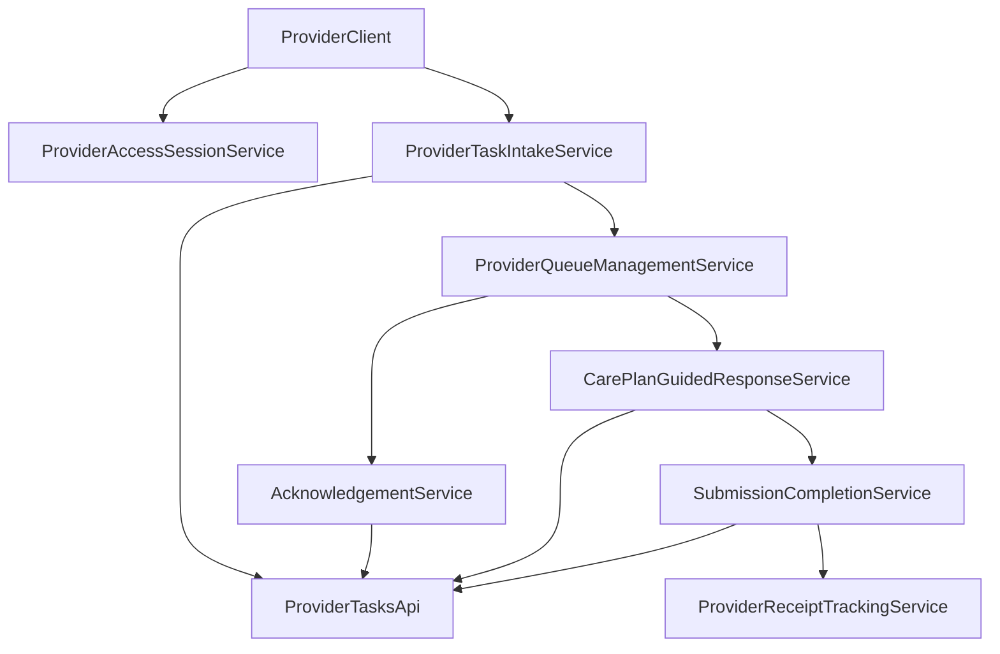

# request.pdhc.provider-portal — Unified Functional Service Specification

## 1) Purpose

`request.pdhc.provider-portal` defines the unified functional service boundary for capabilities currently provided by `standalone-provider-portal`.

This specification is intended as a recode baseline and focuses on:

- service behavior,
- data/endpoint contracts,
- workflow/state rules,
- auth/error semantics,
- and implementation gaps.

No frontend visual/style guidance is included.

---

## 2) Scope and Boundaries

### In scope

- Provider task intake by receipt token
- Provider task synchronization (`my tasks`)
- Task acknowledgment flow
- Task completion/report submission flow
- CarePlan-guided response capture flow (observations/answers)
- Provider receipt/audit feedback model
- Provider API-key based access requirements

### Out of scope

- UI styling/layout/CSS design decisions
- broader admin or non-provider workflows unrelated to provider tasks

---

## 3) Capability Catalog (Product + Operational + Technical)

## 3.1 Provider Access Session Service

**Purpose**  
Establish provider-scoped access context for all operations.

**Functional operations**

- Accept provider API key
- Validate key presence before any provider task call
- Initialize provider portal session context
- Clear session state and sensitive local context

**Contract expectation**

- API key is passed in `X-API-Key`
- Missing/invalid key blocks protected operations

## 3.2 Provider Task Intake Service

**Purpose**  
Load task/order data from backend into provider working queue.

**Functional operations**

- Fetch single task by `receipt_token`
- Sync provider’s task list (`my tasks`) with optional status/limit filters
- Merge remote task state with local queue representation
- Set active task context for downstream operations

**Current endpoint usage**

- `GET /api/v1/provider-tasks/{receipt_token}`
- `GET /api/v1/provider-tasks/my?status=...&limit=...`

## 3.3 Provider Queue Management Service

**Purpose**  
Maintain operational queue state for provider workflow continuity.

**Functional operations**

- Store tasks in local cache for quick access
- Mark one task as active
- Toggle active-only vs full queue view
- Clear local queue data

**Required recode guarantees**

- local cache and server state reconciliation policy
- deterministic queue status display rules
- conflict resolution when server status changes externally

## 3.4 Acknowledgement Service

**Purpose**  
Allow provider to acknowledge task receipt/acceptance.

**Functional operations**

- Validate selected task/token
- Submit acknowledge operation with optional notes
- Update task status locally and from authoritative server response

**Current endpoint usage**

- `POST /api/v1/provider-tasks/{receipt_token}/accept`

## 3.5 Submission/Completion Service

**Purpose**  
Submit provider completion report and payload for a task.

**Functional operations**

- Submit completion using:
  - structured `provider_payload` (including observations where applicable)
  - optional notes
  - optional receipt message
- Record returned completion result/receipt
- Update local task status to terminal/report-submitted state

**Current endpoint usage**

- `POST /api/v1/provider-tasks/{receipt_token}/report`

## 3.6 CarePlan-Guided Response Service

**Purpose**  
Support guided data entry by fetching careplan details and generating transaction-level response capture workflow.

**Functional operations**

- Fetch careplan details linked to provider task
- Render/represent transaction prompts (concepts, expected values, categorical options, units, required flags)
- Validate required responses before submit
- Build normalized observation/report payload per transaction
- Submit through completion endpoint

**Current endpoint usage**

- `GET /api/v1/provider-tasks/{receipt_token}/careplan-details`
- `POST /api/v1/provider-tasks/{receipt_token}/report`

## 3.7 Provider Receipt Tracking Service

**Purpose**  
Provide post-submission operational confirmation and traceability.

**Functional operations**

- Record submission outcomes (message/status/timestamp/token)
- Display recent receipts
- Clear receipt log as local operational action

**Required recode guarantees**

- receipt model must include token correlation and timestamps
- receipt events should be auditable server-side (not just local)

---

## 4) End-to-End Functional Flows

## 4.1 Intake and sync flow

1. Provider key is loaded/validated.
2. Task(s) are fetched by token and/or provider task list sync.
3. Local queue is updated.
4. One task can be marked active for next operations.

## 4.2 Acknowledge flow

1. Active/selected task chosen.
2. Optional notes collected.
3. Acknowledge request submitted.
4. Queue status updated from response.

## 4.3 Guided completion flow

1. Load task-linked careplan details.
2. Build transaction response inputs.
3. Validate required responses.
4. Construct provider payload (`observations` + metadata).
5. Submit report/completion.
6. Record receipt and update queue status.

## 4.4 Manual completion flow

1. Select active task.
2. Enter custom JSON payload/message/notes.
3. Submit report.
4. Record receipt and update status.

---

## 5) Core Data Contract Baseline

## 5.1 ProviderTask

Required functional fields:

- `receipt_token`
- `status`
- `provider` identity fields
- patient/careplan summary fields
- dispatch and timing metadata

## 5.2 CarePlanDetails (provider view)

Required functional sections:

- `patient`
- `careplan`
- `activities`
- `transactions` with concept and requirement metadata

Transaction-level fields needed by guided response logic:

- `transaction_guid`
- `concept_guid`
- `concept_name` / display
- `response_type`
- `valueset_values` (if categorical)
- `unit` / numeric constraints
- required/recommended flag

## 5.3 ReportSubmission

Required request envelope:

- `provider_payload` (object)
- optional `notes`
- optional `receipt_message`

For guided mode, expected payload contents include:

- `observations[]`
  - `transaction_guid`
  - `concept_guid`
  - `value`
  - `unit` (if relevant)
  - `notes` (optional)
  - `recorded_at`

## 5.4 SubmissionReceipt

Required fields:

- `receipt_token`
- `status`
- `message`
- `created_at` / `submitted_at`
- optional provider/task correlation ids

---

## 6) Backend Endpoint Contract Map

Endpoints used by current provider portal runtime:

- `GET /api/v1/provider-tasks/{receipt_token}`
  - Purpose: fetch a specific provider task
- `GET /api/v1/provider-tasks/my`
  - Purpose: list tasks for authenticated provider
  - Query usage: `status`, `limit`
- `POST /api/v1/provider-tasks/{receipt_token}/accept`
  - Purpose: acknowledge/accept task
- `POST /api/v1/provider-tasks/{receipt_token}/report`
  - Purpose: submit completion/report payload
- `GET /api/v1/provider-tasks/{receipt_token}/careplan-details`
  - Purpose: fetch expanded careplan/task details for guided response

### Auth enforcement expected on all above

- API key auth via `X-API-Key`
- provider-scoped authorization (read/write scope separation)

---

## 7) Error Semantics and Failure Modes

Standard required behavior:

- `400` invalid token/payload/validation error
- `401` missing or invalid API key
- `403` key valid but scope/provider mismatch
- `404` task/careplan not found
- `409` duplicate or conflicting acknowledgement/report action
- `422` semantic validation failure (e.g., required observation missing)
- `500` internal processing failure

### Functional error requirements

- Provide machine code + readable message on all failures
- Return actionable cause for provider operations
- For guided submissions, identify exact missing/invalid transaction response(s)

---

## 8) Non-Functional Requirements (Function Priority)

## 8.1 Consistency and idempotency

- Acknowledge and report operations need idempotency policy.
- Re-submitting same report payload should have deterministic behavior.

## 8.2 Audit and traceability

- Acknowledge/report actions must be server-auditable with actor identity and timestamps.
- Receipt tokens must map to immutable operation history.

## 8.3 Reliability and recovery

- Queue sync must recover from temporary network failures.
- Local cache must not become source of truth over server state.

## 8.4 Security

- Strict API key scope enforcement on provider task endpoints.
- Sensitive local storage use should be minimized and controlled.
- Cross-window messaging in guided popup flow must include strict origin validation in recode.

---

## 9) Gap Analysis for Recode

Current strengths:

- Complete core provider task flow exists (fetch, sync, acknowledge, report).
- Guided careplan details + transaction-driven response collection exists.
- Receipt feedback and local queue operations exist.

Key recode gaps:

- Formal endpoint-level idempotency contract for accept/report.
- Stronger auth contract documentation and scope matrix.
- Explicit submission schema versioning for provider payloads.
- Server-side receipt query endpoint for robust post-submit reconciliation (recommended).
- Hardening cross-window communication security and local storage policies.

---

## 10) Recommended Service Decomposition for Re-implementation

- `ProviderAccessSessionService`
- `ProviderTaskIntakeService`
- `ProviderQueueManagementService`
- `TaskAcknowledgementService`
- `CarePlanDetailsService`
- `GuidedResponseComposerService`
- `TaskReportSubmissionService`
- `ProviderReceiptService`
- `ProviderAuditTelemetryService`

Recommended sequencing:

1. Freeze provider task API contracts and auth scope matrix.
2. Implement intake/sync + queue reconciliation.
3. Implement acknowledge path with idempotency.
4. Implement guided details + response composition.
5. Implement report submission + receipt persistence/query.
6. Add audit/telemetry and failure conformance tests.

---

## 11) Acceptance Criteria

`request.pdhc.provider-portal` is functionally complete when:

- All services in Sections 3.1–3.7 are implemented and contract-tested.
- Endpoint behaviors in Section 6 are stable and documented.
- Auth, validation, and error semantics are consistent across all provider operations.
- Guided response submissions enforce required transaction-level data quality.
- Audit trail and receipt traceability are available for all acknowledge/report actions.

---

## 12) Short Operational Summary

`request.pdhc.provider-portal` is the provider-facing operational service layer for:

- retrieving assigned/dispatched tasks,
- acknowledging work intake,
- submitting completion payloads (manual or careplan-guided),
- and receiving auditable submission receipts,

under a single recode-ready, function-centric contract.

